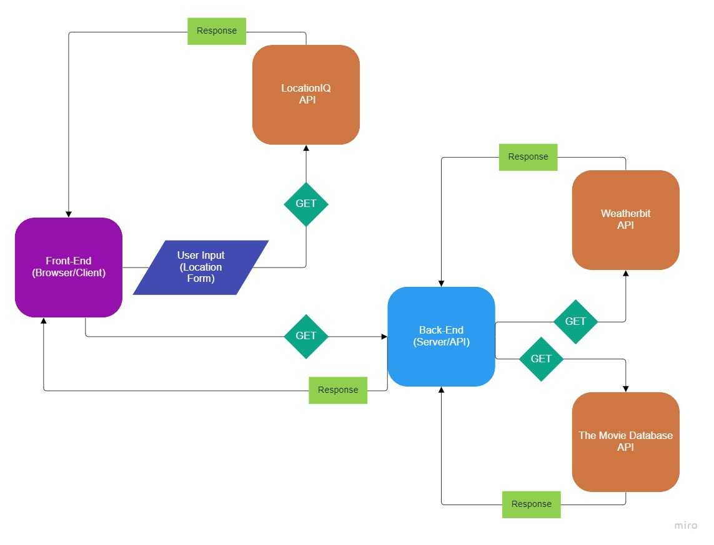

# City Explorer

**Author**: Robert Shepley  


## Overview

This project is being developed as a full-stack mapping application. It will allow the user to input a location and, if the location is valid, receive information about it in the form of a map, coordinates, and weather data.

## Getting Started

### [Live Site](https://shepleysound-city-explorer.netlify.app/)

To build the site on your local machine, perform the following steps -

1. Clone the repository to your local machine.

   ```bash
   git clone https://github.com/ShepleySound/city-explorer.git
   cd city-explorer
   ```

2. Install dependencies

   ```bash
   npm install
   ```

3. Rename .env.sample to .env

   ```bash
   mv .env.sample .env
   ```

4. Create a [locationIQ](https://locationiq.com/) account.
5. Create a free API Access Token.
6. Copy/Paste the token into your .env file.

   ```bash
   # Replace <locationIQ API Key> with your own key! 
   REACT_APP_LOCATIONIQ_API_KEY=<locationIQ API Key>
   ```

7. Run the `start` react-script

   ```bash
   npm start
   ```

## Architecture
<!-- Provide a detailed description of the application design. What technologies (languages, libraries, etc) you're using, and any other relevant design information. -->
Front-End - [React](https://reactjs.org/)  
Icons/Logo - [Icons8](icons8.com)  
Design/Styling - [react-bootstrap](https://react-bootstrap.github.io/)  
Mapping/Geocoding API - [LocationIQ](https://locationiq.com/)  
HTTP Client - [Axios](https://www.npmjs.com/package/axios)

This project was bootstrapped with create-react-app. The application uses Axios as an HTTP client to query the LocationIQ API using a simple text input from the user. If a valid response is received, the application requests further data in the form of a map image, which is then displayed to the page.

<details><summary>Front-End Response Request Diagram</summary>



</details>

## Change Log
<!-- Use this area to document the iterative changes made to your application as each feature is successfully implemented. Use time stamps. Here's an example:
-->

***08-22-2022 3:00pm*** - Application is initialized and ready for development.  

***08-22-2022 4:45PM*** - Application receives input, queries the locationIQ API, and outputs valid results.  

***08-22-2022 6:00PM*** - Application outputs a map from the locationIQ API on valid input.  

***08-22-2022 9:30PM*** - Application outputs a warning when the API responds with an error.  

***08-23-2022 6:15PM*** - Application displays weather data for static data from a custom API.

## Credit and Collaborations
<!-- Give credit (and a link) to other people or resources that helped you build this application. -->

## Time Estimates

### August 22, 2022

| Feature Name | Estimated Time | Start Time | Finish Time |
| ------------ | -------------- | ---------- | ----------- |
| Repository/Project Setup | 30 Minutes | 2:40PM | 3:00PM |
| Location Data | 1 Hour | 3:15PM | 4:45PM |
| Static Map | 1 Hour | 4:50 | 5:55PM |
| Page Styling | 2 Hours | 6:30PM | 8:00PM |
| Error Handling | 1 Hour | 8:15PM | 9:30PM |

### August 23, 2022

| Feature Name | Estimated Time | Start Time | Finish Time |
| ------------ | -------------- | ---------- | ----------- |
| Weather Client | 45 Minutes | 5:30PM | 6:15PM |

### August 25, 2022

| Feature Name | Estimated Time | Start Time | Finish Time |
| ------------ | -------------- | ---------- | ----------- |
| Movie Client | 45 Minutes | 07:45AM | 08:45AM |
